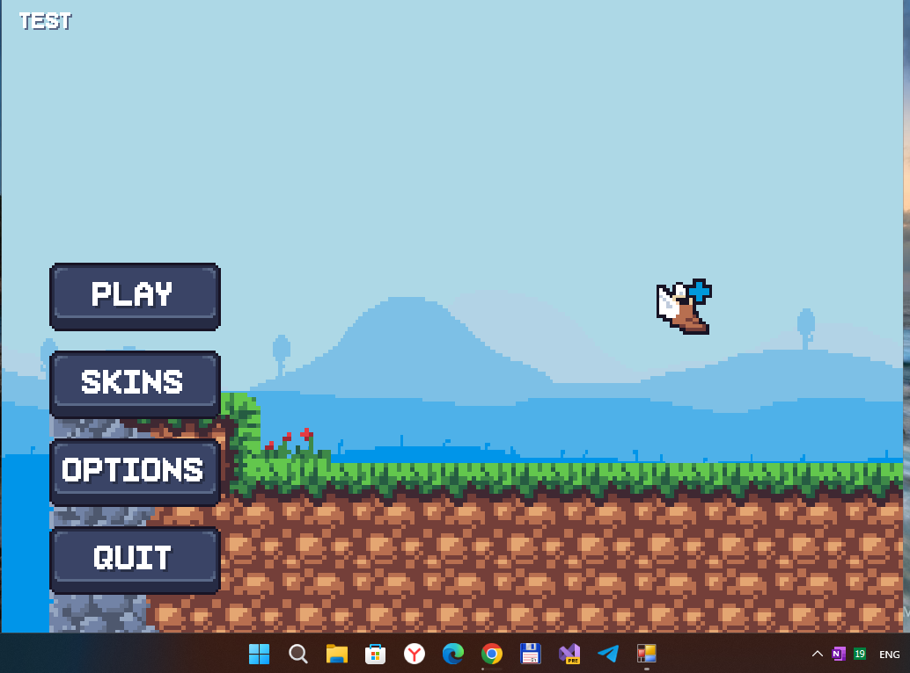

## Chicken? v1.0.1 (Chicken2 codename; desktop; pre-pre-alpha)

This is my fork of the desktop monogame "Chicken?" demo project:
https://sorceresslyra.itch.io/chicken-2

My main goal is/was: adapdation for W10M (Astoria support planned too). 

## Screenshot(s)

## My 2 cents (status)
- Fast R.E.... 
- Project tuned on(to) "firm" Monigame.Framwork 3.8.xx...
- Some project research and minimal "re-dev"...
- W10(M) UWP template not ready yet... (imGUI . NET is hardcore ))

## A few words (description) frow the author(original)

The long awaited sequel to Chicken? is now here! Play the demo and experience the all new features of this brand new game.

How do I play?

- Gamepad	Computer	Action
- A Button
- Spacebar	Jump
- Right stick click
- Left click
- Interact with UI
- Right stick
- Mouse	Move cursor

2023 UPDATE!
- What's new?
- Shop now remembers purchases and shows currently selected skin
- Options implemented
- Native controller support
- Native linux support (Steam deck support)
- PowerUp UI and feedback

### More information
- Status:	Prototype
- Platforms:	Windows
- Author:	sorceresslyra
- Made with:	MonoGame
- Tags:	2D, Exploration

## Goals (ToDo-s)
- Create Wiki
- Explore Becher's super-cool object-oriented programming
- Add more indicators / virtual gamepad, etc.
- Add more gameplay elements
- Improve AI
- Add story elements
- Add more sound effects for everything :)

## Reference(s)
- [sorceresslyra](https://sorceresslyra.itch.io/) sorceresslyra at itch.io (author of original Chicken? game)

## ..
As is. No support. RnD only. DIY.

## .
[m][e] 2024

